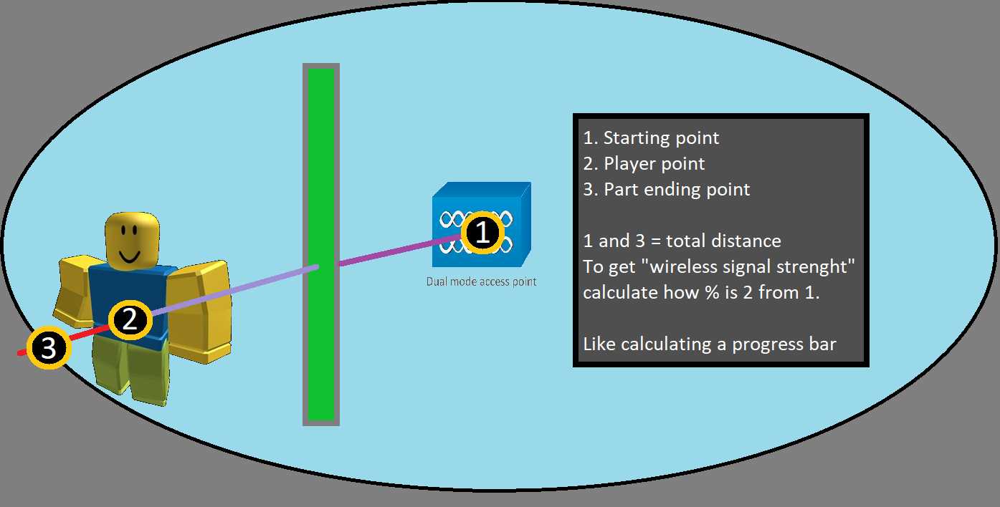

# RobloxMonarca
Simulador de redes inalámbricas creado en Roblox Studio para el plan de red de la fábrica de Aluminio Monarca

## Author: Manolo Ramírez Pintor
## ITESM Campus Qro

## Getting the wireless signals
To get started with the simulation, there is a code that gets parts from the roblox workspace, creates raycasts that go through walls and returns a wireless signal strength in percentage minus what was crossed in the course of creating and calculating the wireless signal.

The function returns different values depending on the needs and some specific conditions.

## How to use it

To use this code, you need to import the SignalModule.lua file into your roblox project. Then, you need to call the  `getSignal`  function with the following parameters:

-   `part1`: The first part that represents the origin of the wireless signal. It must be a BasePart object.
-   `part2`: The second part that represents the destination of the wireless signal. It must be a BasePart object.
-   `maxRange`: The maximum range of the wireless signal in studs. It must be a positive number.
-   `areas`: A table of parts that represent the areas of the factory where the wireless signal is needed. It must be an array of BasePart objects.

The function will return a string or a number depending on the result of the raycast. If the distance between the parts is greater than the maximum range, or if the signal strength is below 5%, it will return  `"Signal lost"`. Otherwise, it will return the signal strength as a percentage.

## Controlling the UI and main logic of the simulation
The iPhoneGUI document summarizes the different sections of the code that makes a GUI work to test the wireless signal.  [The code is written in Lua and uses Roblox Studio’s built-in GUI elements and their containers](https://create.roblox.com/docs/tutorials).

## PhoneUI

This section of the code controls the following things to create a complete system of wireless network simulation:

-   Showing and hiding the iPhone
-   Closing the open interfaces when pressing the HOME button
-   Updating the status bar according to the signal value
-   Making the icons open an app
-   Making Safari functional
-   Making Spotify functional
-   SignalStrenght and network zones
-   The Wi-Fi menu of Settings to select between networks
-   The Settings menu
-   The Wi-Fi menu of settings

The code uses variables, references, tweens, events and functions to achieve these functionalities.

## SignalModule

This section of the code imports the SignalModule that returns a response from the server based on the position of the player and the routers in the workspace. The code defines the routers, their ranges, and their areas of connection. It also defines a variable to specify if the player is inside a MESH network or not, and another variable for the use cases:

-   0 = Current network
-   1 = New network (MESH)

The code uses a function called onTouched to change networks (roaming) and another function called updateSignal to change the signal value between routers based on the data of their positions.

## Home Button

This section of the code makes the home button have animation and functionality. It references the frame where the button is located and defines its default color. It also creates tweens for changing its position and color when pressed. It connects the Activated event of the button to a function that plays the tweens and closes any open apps.

## App Manager

This section of the code opens the apps from the iPhone’s home menu and makes a fade of the splash screen of each app before showing its content. It references each splash screen and its objects, and defines their initial properties. It also creates tweens for opening and closing each splash screen. It references each app button (icon) from the home menu and connects them to functions that play the splashes and open the apps.

## Browser

This section of the code makes Safari functional by simulating web loading based on signal value and internet speed. It references the update button and defines a function that resets and changes the size of the scrolling frame according to a formula. It connects the Activated event of the button to this function.

## Spotify App

This section of the code makes Spotify functional by playing an audio file from Roblox assets. It references the play and pause buttons and defines variables for storing sound time position and playing status. It connects these buttons to functions that play or pause sound depending on signal value. It also defines a function that formats time in MM:SS format.

## Wi-Fi Settings

This section of the code makes Wi-Fi settings functional by allowing users to select between different networks. It references each network button and its selected state, and defines their default values. It connects these buttons to functions that change their selected state and update global variables for use cases.

## Real-Time Data Update

This section of the code updates data in real time using spawn functions that run in parallel threads. It references UI elements such as system time, signal icons, song current time, etc., and updates them using loops, conditions, formulas, etc.

## Conclusion

This project was a valuable learning experience for me as I explored the concepts of wireless networking and how to simulate them using Roblox Studio. I was able to create a realistic and interactive GUI that responds to different signal values and internet speeds. I also learned how to use various GUI elements and their containers, such as frames, labels, buttons, text input objects, proximity prompts, etc. I also learned how to use tweens, events, functions, and modules to make my code more organized and efficient. I think Roblox Studio is a powerful tool for creating simulations and games that can teach and entertain users.

## More information

For more information about Roblox Studio, wireless networks and Aluminio Monarca, you can visit these links:

-   [Roblox Studio](https://developer.roblox.com/en-us/resources/studio)
-   [Wireless network](https://en.wikipedia.org/wiki/Wireless_network)
-   [Aluminio Monarca](https://www.aluminiomonarca.com.mx/)
